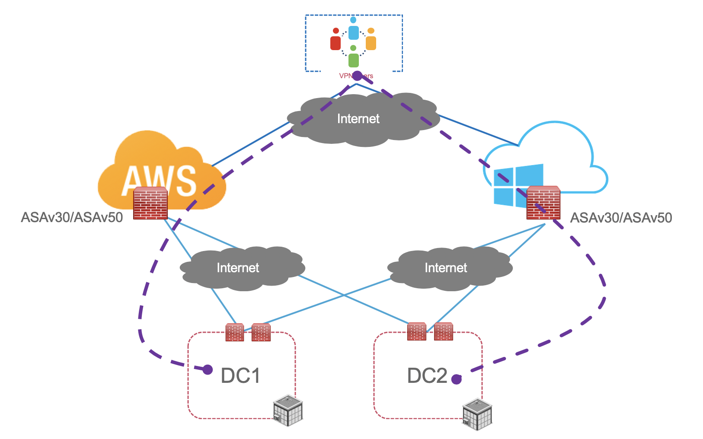
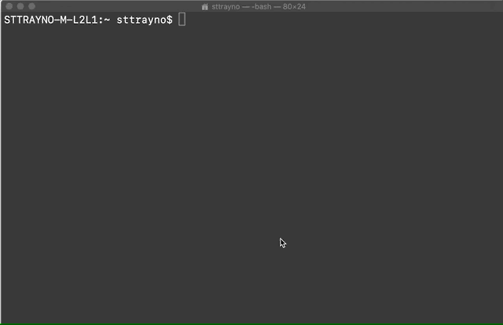

# Automated ASA deployment on AWS with Ansible 

With the current situation and the increase in mandatory work from home, enabling remote access has become a key priority for IT departments including the need to quickly scale such functions. One way we've seen to quickly do that is through the use of Cisco ASA, once deployed the ASA can be flexibily configured to allow for supporting IPSec/SSL remote access VPN's with also the option for IPSec site-to-site to allow you tunnel back into your own headend infrastructure.

The virtual ASA appliance - ASAv for short has recently become very popular with enterprises looking to deploy quick VPN capacity, we’ve seen good expamples of this with some enterprises deploying in cloud services like AWS, Azure and GCP then creating a site-to-site tunnel back to their own on-premise datacentres to allow for fast scaling of remote access infrastructure.



That process for deploying within the cloud systems can be quite confusing to a beginner, however is actually a very simple process which we intend to break down here for the reader and then look to automate through common tools such as ansible.

In this guide we’re going to show a way to automate much of that deployment to allow you to quickly spin up ASA capabilities as required and potentially even automate much of the actual on the box deployment for enabling features like Anyconnect VPN's. 

```
Disclaimer: In this guide we're using a sample base config for enabling SSL VPN functionality on our ASA. The exact config will depend based on your individual requirements for your organisation. We're looking to demonstrate the process here of how such functionality can be automated here but your config can be easily modified by changing the asa_template.j2 file included in this repo
```

This approach to spinning up services is an excellent demonstration of NFV and could also be applied to other services such as routing, wireless LAN controllers and any other services that could be deployed in cloud platforms with a couple of small tweaks.

## AWS Prerequisites

Before we get started on this guide you'll need a few things. First being an AWS account [which you can sign up for here](https://aws.amazon.com). Once you've signed up for an AWS account we've then got a few bits and pieces to configure. The first being networking

### Networking

In order to deploy our ASA we'll need at least a VPC and 3 subnets. Our playbook should then configure the other required resources such as elastic IP addresses and network interfaces, but for now lets go through what we need to create.

In every region you should have a default VPC which we'll build our subnets in, this should have a IP address block of 172.31.0.0/16 which we we'll build our subnets from. Feel free to specify your own address pools here however you can also use the ones below.

To build these subnets from the AWS management console select VPC from services under "networking and content delivery" then hit the subn(ets resource. Follow the process to then create the subnets like our animations below:


By the end you should have the three following subnets

172.31.0.0/20 - inside

172.31.0.254.0/24 - outside

172.31.0.255.0/24 - management

Take a note of the subnetid beginnging in "subnet-" we'll need that later for the playbook.

```
Note: To understand AWS networking in detail theres a fantastic video from AWS invent which is a well worth watching to understand the [fundamentals](https://www.youtube.com/watch?v=hiKPPy584Mg)
```

### An AMI image

### Keypair

We'll also need to define a keypair to generate a certificate to have access to our device. This can be done by selecting the keypairs service within the EC2 menus under "Network & Security" and following the create keypair wizard


### Secret and Access keys

Lastly if not already done so we need to create a IAM secret key and and access key. This can be done from the use the [security credentials page](https://console.aws.amazon.com/iam/home?#/security_credentials) and going to the "Access keys (access key ID and secret access key)" drop down then selecting generate new access key. As can be seen from the animation below:


Keep a note of those values we'll need them shortly

```
Note: If you already have the maximum of two access keys—active or inactive—you must delete one first before proceeding.
```

## Ansible playbook

Now we have our AWS environment where it needs to be we can turn our attention towards the Ansible portion.

I know this playbook could be made shorter and simplified with roles. However I wanted to give people the opportunity to use this playbook with Ansible when they're just getting started. In the walkthrough section below we'll walk through each of the tasks taking place to configure our ASA using Ansible.

### Walkthrough

  - name: Create management interface
    
    description: Create an network interface resource within AWS for our management within the region specified


  - name: Create outside interface
    
    description: Create an network interface resource within AWS for our management within the region specified


  - name: Create inside interface
   
    description: Create an network interface resource within AWS for our management within the region specified


  - name: allocate a new elastic IP inside a VPC in region
   
    description: Allocate a public IP within our region to be assigned later to our device


  - name: allocate a new elastic IP inside a VPC in region
    
    description: Allocate a public IP within our region to be assigned later to our device
    
    
  - name: Deploy virtual ASA


  - name: get public IP for our interface


  - name: get public IP for our interface


  - name: Wait for SSH to come up
    
    description: Self explanitory, wait for the ASA to boot and for SSH access before we can do our next config


  - name: configure ASA interface managememt


  - name: configure ASA interface inside


  - name: configure ASA interface outside
    description: Optional but good practice for ongoing management of device


  - name: enable ADSM
    description: Optional but good practice for ongoing management of device
    
    
  - name: render a template onto an ASA device
    description: Place a config onto the device, in our case for client SSL VPN access


### Configure environment variables

We do need to provide Ansible with our AWS credentials probably the simplest way to do this, whilst maintaining some level of security is to set them as an environment variable in your shell. This can be done by running the below commands, obviously replacing the placeholders below for your ACCESS/SECRET key we generated in the pre-requesites. Set host checking to false too to allow Ansible to log into our ASA without seeing the RSA fingerprint before.

```
export AWS_ACCESS_KEY_ID='<YOUR ACCESS KEY>'
export AWS_SECRET_ACCESS_KEY='<YOUR SECRET KEY>'
export ANSIBLE_HOST_KEY_CHECKING=False
```



Remember not to share these keys with anyone, they secure your AWS account and someone could use them to spin up all sorts so keep them safe.

### Run the playbook

Lastly

## Final thoughts

