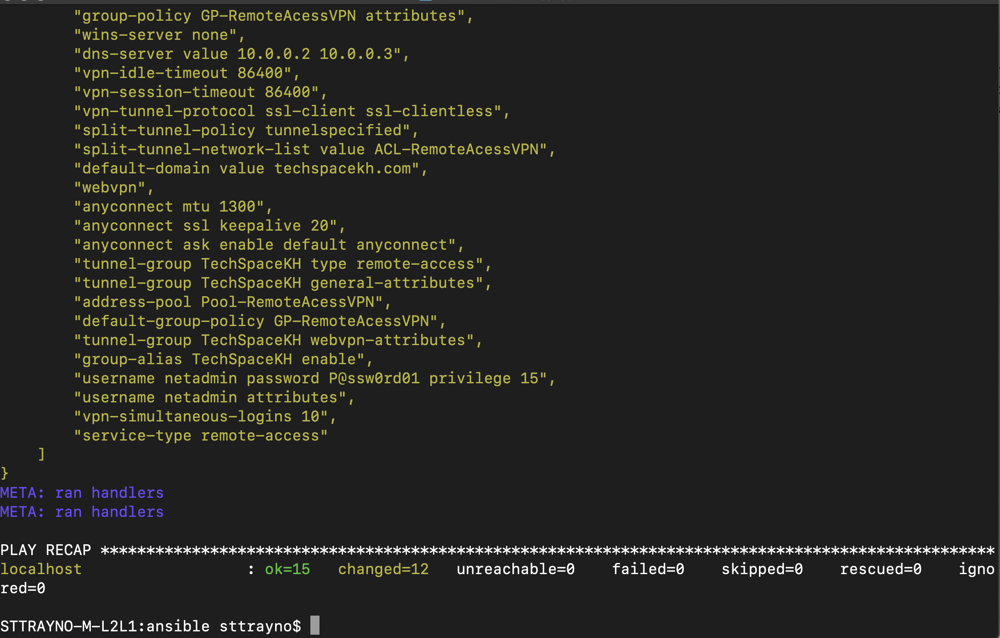

# Automated ASA deployment on AWS with Ansible

With the current situation and the increase in mandatory work from home, enabling remote access has become a key priority for IT departments including the need to quickly scale such network functions as needed.

One way we've seen to quickly do that is through the use of Cisco ASA Firewall, once deployed the ASA can be flexibility configured as a VPN concentrator to allow for supporting IPSec/SSL remote access VPN's with also the option for IPSec site-to-site to allow you tunnel back into your own hardened security infrastructure.

The virtual ASA appliance - ASAv for short has recently become very popular with enterprises looking to deploy quick VPN capacity. We’ve seen good examples of this with some enterprises deploying ASA in cloud services like AWS, Azure and GCP, then creating a site-to-site tunnel back to their own on-premise datacentres to allow for fast scaling of remote access infrastructure.


That process for deploying within cloud systems can be quite confusing to a beginner, however it is actually a very simple process which we intend to break down here for the reader and then look to automate through common tools such as Ansible.

In this guide we’re going to show a way to automate much of that deployment to allow you to quickly spin up ASA capabilities as required and potentially even automate much of the actual on the box deployment and configuration for enabling features like Cisco Anyconnect VPN.

```
Disclaimer: In this guide we're using a sample base config for enabling SSL VPN functionality on our ASA. The exact config will depend based on your individual requirements for your organisation. We're looking to demonstrate the process here of how such functionality can be automated here but your config can be easily modified by changing the asa_template.j2 file included in this repo
```

This approach to spinning up services is an excellent demonstration of NFV (Network functions virtualisation) and could also be applied to other services such as routing, wireless LAN controllers and any other services that could be deployed in cloud platforms like AWS with a couple of small tweaks.

## AWS Prerequisites

Before we get started on this guide you'll need a few things. First being an AWS account [which you can sign up for here](https://aws.amazon.com). Once you've signed up for an AWS account we've then got a few resources to configure. The first being the networking.

### Networking

In order to deploy our ASA we'll need at least a VPC (Virtual Private Cloud) and 3 subnets.

Our playbook should then configure the other required resources such as elastic IP addresses and network interfaces, but for now lets go through what we need to create.

In every region you should have a default VPC which we'll build our subnets in, this should have a IP address block of `172.31.0.0/16` which we we'll build our subnets from. Feel free to specify your own address pools here however you can also use the ones below.

To build these subnets from the AWS management console select VPC from services under "networking and content delivery" then select the subnets resource.

Follow the process to then create the subnets like our animations below:


By the end you should have the three following subnets (feel free to customise the IP blocks, they don't need to be exactly as I've laid out here.

Inside: `172.31.0.0/20`

Outside: `172.31.0.254.0/24`

Management: `172.31.0.255.0/24`

### AMI

We'll also need the AMI id of a valid ASA deployment for our playbook to go out and deploy the right image. I've made a custom one with a password set so that Ansible can easily access it without needing to supply a .pem file and with the anyconnect images preloaded also. If you'd like to use my image drop me a message and I can look to share it with you. Alternatively you can do a search for publically available AMI's and search for ASAv to find available images you can use.


**IMPORTANT:** Take a note of the subnetid beginning in "subnet-" we'll need that later for the playbook.

> Note: To understand AWS networking in detail there is a fantastic video from AWS invent which is a well worth watching to understand the [fundamentals](https://www.youtube.com/watch?v=hiKPPy584Mg)

### Key Pair

We'll also need to define a key pair to generate a certificate to have access to our device. This can be done by selecting the key pairs service within the EC2 menus under "Network & Security" and following the create key pair wizard. Keep that key pair somewhere safe for access to the device.


### Secret and Access keys

Lastly if not already done so we need to create a IAM secret key and access key.

This can be done from the use the [security credentials page](https://console.aws.amazon.com/iam/home?#/security_credentials) and going to the "Access keys (access key ID and secret access key)" drop down then selecting generate new access key.

As can be seen from the animation below:


Keep a note of those values we'll need them shortly.

> Note: If you already have the maximum of two access keys—active or inactive—you must delete one first before proceeding.

**IMPORTANT:** Remember not to share these keys with anyone, they secure your AWS account and someone could use them to spin up all sorts so keep them safe. As soon as I finished writing this guide I rotated the the keys for my account as you should on a regular basis.

## Ansible playbook

Now we have our AWS environment where it needs to be we can turn our attention towards the Ansible portion.

This playbook could be made shorter and simplified by using ansible functionality roles. However I wanted to give people the opportunity to use this playbook with Ansible when they're just getting started. In the walkthrough section below we'll walk through each of the tasks taking place to configure our ASA using Ansible.

### Walkthrough

```yaml
- name: Create management interface
  description: Create an network interface resource within AWS for our management within the region specified

- name: Create outside interface
  description: Create an network interface resource within AWS for our management within the region specified

- name: Create inside interface
  description: Create an network interface resource within AWS for our management within the region specified

- name: allocate a new elastic IP inside a VPC in region
  description: Allocate a public IP within our region to be assigned later to our device

- name: allocate a new elastic IP inside a VPC in region
  description: Allocate a public IP within our region to be assigned later to our device

- name: Deploy virtual ASA
  description: Deploy the ami image for the ASA and map our interfaces to it

- name: get public IP for our interface
  description: Find the public IP that was assigned to our interfaces so we can use them later in the playbook

- name: get public IP for our interface
  description: Find the public IP that was assigned to our interfaces so we can use them later in the playbook

- name: Wait for SSH to come up
  description: Self explanatory, wait for the ASA to boot and for SSH access before we can do our next config

- name: configure ASA interface management
  description: Configure the management interface on the ASA

- name: configure ASA interface inside
  description: Configure the inside interface on the ASA

- name: configure ASA interface outside
  description: Configure the outside interface on the ASA

- name: enable ADSM
  description: Optional but good practice for ongoing management of device

- name: render a template onto an ASA device
  description: Place a config onto the device, in our case for client SSL VPN access. The config that will be copied is the asa-template.j2 file.
```

### Configure environment variables

We do need to provide Ansible with our AWS credentials. Probably the simplest way to do this, whilst maintaining some level of security is to set them as an environment variable in your shell.

This can be done by running the below commands, obviously replacing the placeholders below for your ACCESS/SECRET key we generated in the prerequisites.

Set host checking to false too to allow Ansible to log into our ASA without seeing the RSA fingerprint before.

```bash
export AWS_ACCESS_KEY_ID='<YOUR ACCESS KEY>'
export AWS_SECRET_ACCESS_KEY='<YOUR SECRET KEY>'
export ANSIBLE_HOST_KEY_CHECKING=False
```


> Remember not to share these keys with anyone, they secure your AWS account and someone could use them to spin up all sorts so keep them safe. As soon as I finished writing this guide I rotated the the keys for my account as you should on a regular basis.

### Run the playbook

Now all that is left to do is run our playbook.

Within the playbook you should see some placeholders where you will have to set your own variables for your environment, these include username and password of the ASA, AWS region, subnetID's of the networks we created earlier, and the AMI id of our image.

Fill all these in for the playbook to run successfully and then run the below command as can be seen from the animation

```bash
ansible-playbook aws-asa.yaml -vvvv
```

> The -vvvv flag is optional but this enables verbose mode which will make things easier should you have to troubleshoot.


This will take anywhere up to 15 minutes, so go take a break. When you come back you should have something like below:



Now the image has been deployed and should now be running lets go to AWS EC2 and find out the outside IP address of our device (NOT the management, which will be the primary IP shown).


If our config has rendered correctly you should be able to navigate to `https://<IP-OF-OUTSIDE-INTERFACE>` and login with the username specified in the config (username netadmin password P@ssw0rd01) unless you've changed that and download the Anyconnect VPN image. Alternatively if you have the Anyconnect client installed just put the IP address of the outside interface into the field and connect.

You can see both options from the graphics below.


## Final thoughts

This guide should provide a way for you to begin to understand how services such as the ASAv can deployed on platforms like AWS. Clearly you will need to tailor this to your exact environment but what we wanted to demonstrate here was the concept of NFV on cloud platforms and how quickly these services can be spun up with common automation tools such as Ansible.

As mentioned previously this guide could adapted for other virtualised network appliances such as eWLC or CSR1000v with relative ease, should you have any use cases around this it would be great to hear.

Having playbooks that automate these kind of processes allows easy deployment as we've shown but also allows integration into CICD pipelines organisations may have.

Please provide feedback on this guide if any sections are unclear and if you have any problems raise a quick issue and we'll do our best to support.
